<div align="center">


# Nuvem Ruscher

**Seu próprio Google Fotos, neste computador — para a família inteira.**
Instala, configura e cuida do [Immich](https://immich.app) no BigLinux, com as fotos no disco
que você escolher, uma conta para cada pessoa e os celulares enviando tudo sozinhos.

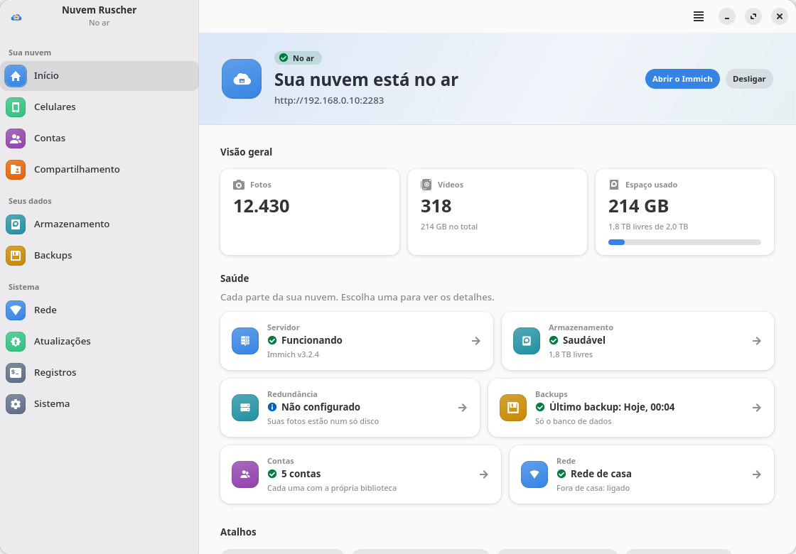
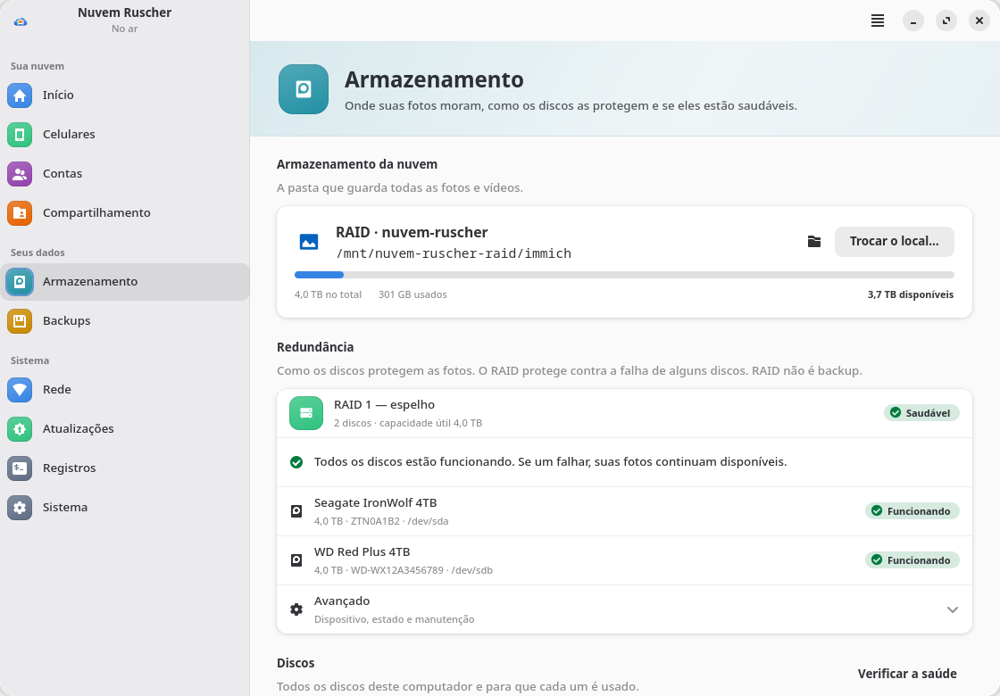

</div>

---

## O que ele faz

- **Assistente do primeiro clique ao celular sincronizando:** verificação do sistema com correção em
  um clique, escolha do disco, instalação com progresso real, conta de administrador e QR codes.
- **Android e iPhone com o mesmo cuidado:** escolha o celular e o app mostra a loja certa (Play
  Store, F-Droid ou App Store), o endereço para digitar no Immich e os passos daquele sistema —
  bateria no Android; Background App Refresh, Rede Local e Fotos do iCloud no iPhone. Em casa pelo
  Wi-Fi, fora de casa pelo Tailscale. Um teste diz se o servidor responde no endereço e, quando
  não, o que fazer.
- **Fotos sagradas.** Nada nos seus discos é apagado, formatado ou movido sem você pedir e confirmar.
  O banco de dados fica no disco interno; as fotos, no disco que você escolheu.
- **Uma conta para cada pessoa** (o modelo do próprio Immich): login, biblioteca, backup do celular e
  álbuns próprios, com quota de espaço. A senha inicial é gerada e trocada no primeiro acesso; para
  contas desativadas, o app explica o prazo do Immich.
- **Pastas compartilhadas** (álbuns compartilhados do Immich): quem *pode adicionar* e quem *só vê*,
  com o que cada papel faz de verdade; e bibliotecas inteiras compartilhadas (partners).
- **Trocar o local das fotos com segurança:** copia com o servidor no ar, para por alguns minutos,
  confere a cópia (quantidade, bytes, comparação e amostra de SHA-256), troca e confirma de dentro do
  servidor. Qualquer falha volta tudo como estava; a cópia antiga só é removida se você pedir.
- **Redundância com RAID** (mdadm): RAID 1 recomendado, outros níveis em *Avançado* com os riscos
  explicados. O disco do sistema, o das fotos e qualquer disco em uso ficam protegidos, e cada disco
  a apagar é confirmado um a um. Estado do RAID e saúde dos discos (SMART) aparecem no painel.
  *RAID não é backup* — o app diz isso onde importa.
- **Funciona depois de reiniciar e nunca grava no lugar errado:** o servidor só liga com o disco das
  fotos montado e liga sozinho quando ele aparece.
- **Atualização segura** com backup, cópia instantânea do banco e volta automática.
- **Desinstalação honesta:** remove o servidor, nunca as fotos.

## Capturas

| | |
|---|---|
| 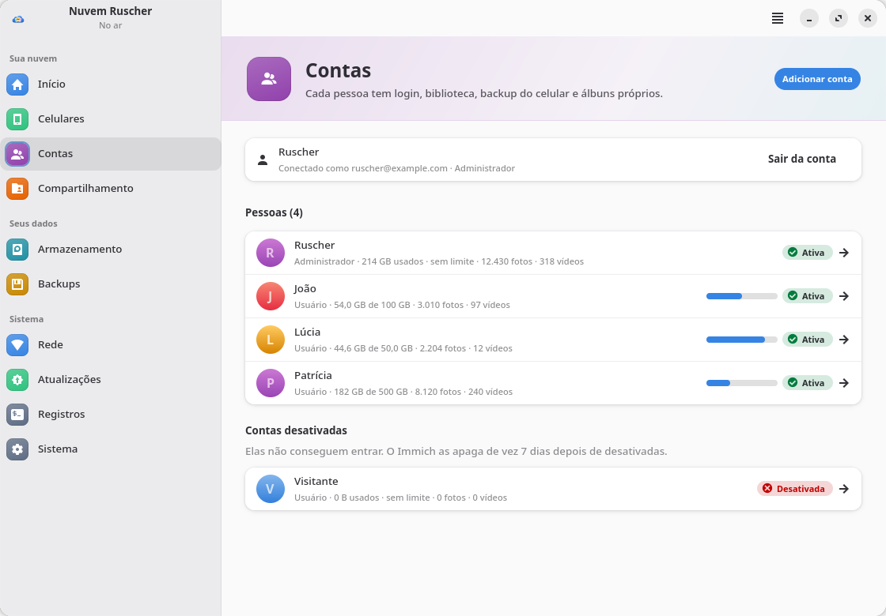 | 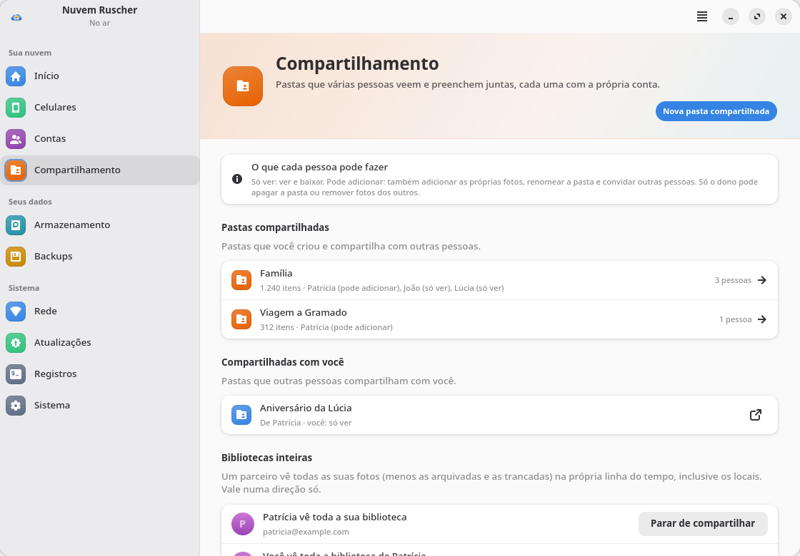 |
| **Contas** — uso e quota de cada pessoa | **Compartilhamento** — pastas, papéis e bibliotecas inteiras |
| 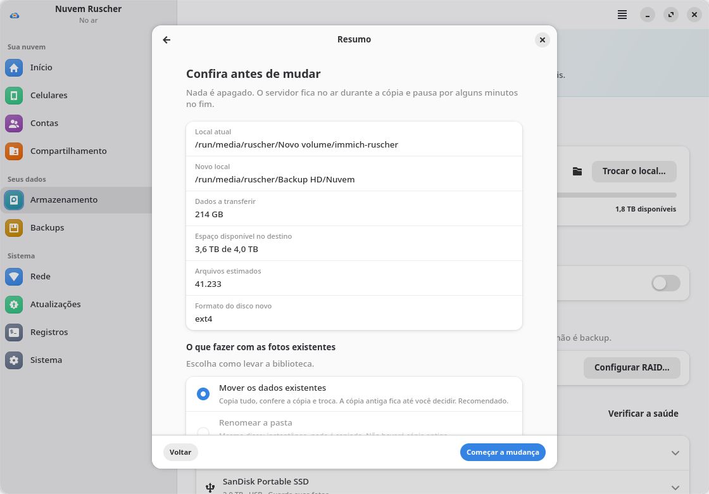 | 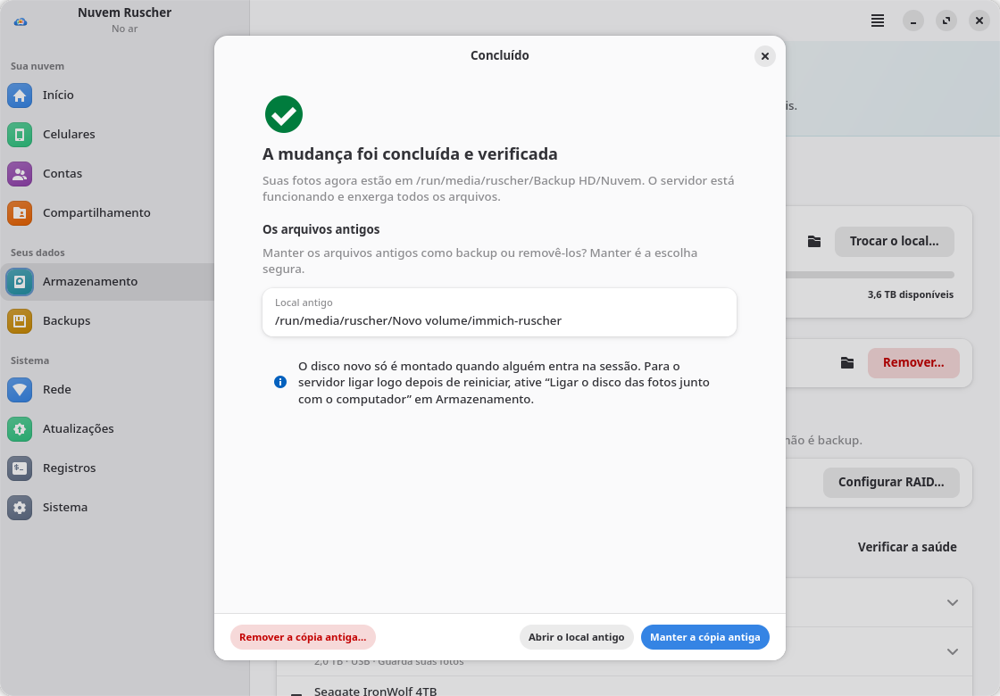 |
| **Trocar o local** — tudo conferido antes de começar | **Concluída e verificada** — a cópia antiga fica até você decidir |
| 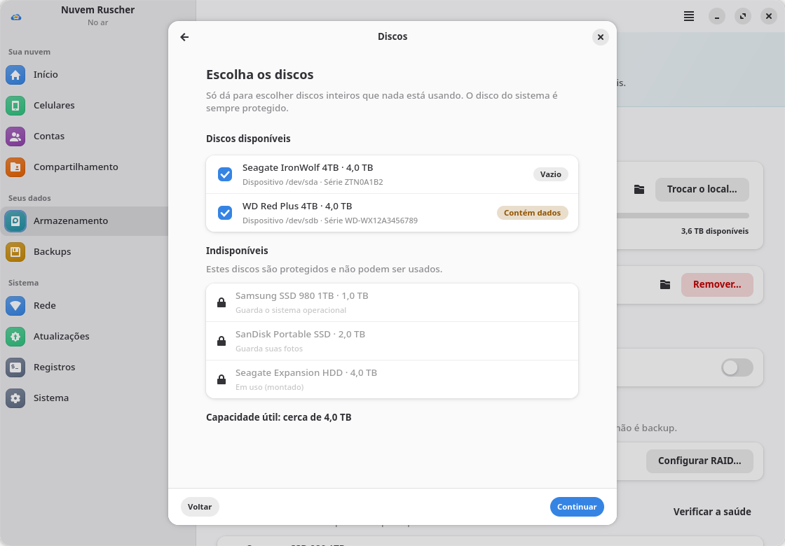 | 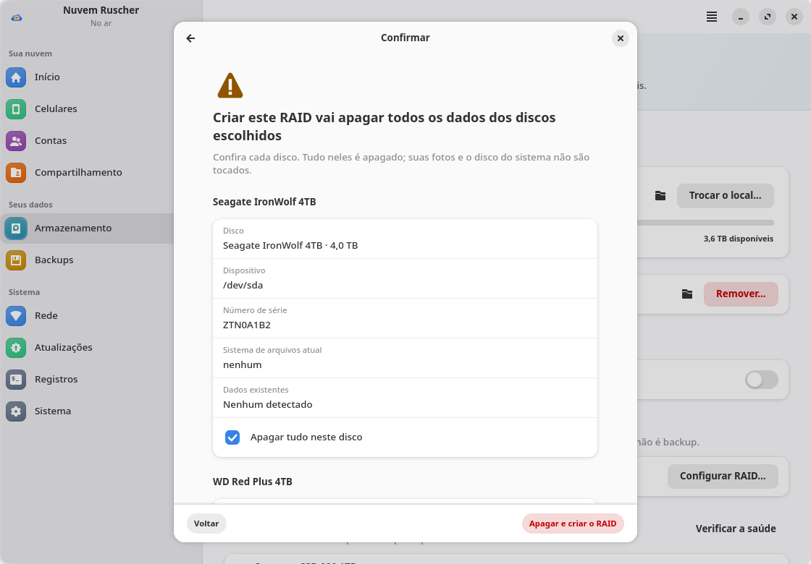 |
| **RAID** — discos protegidos aparecem com o motivo | **Confirmação** disco a disco antes de apagar |
| 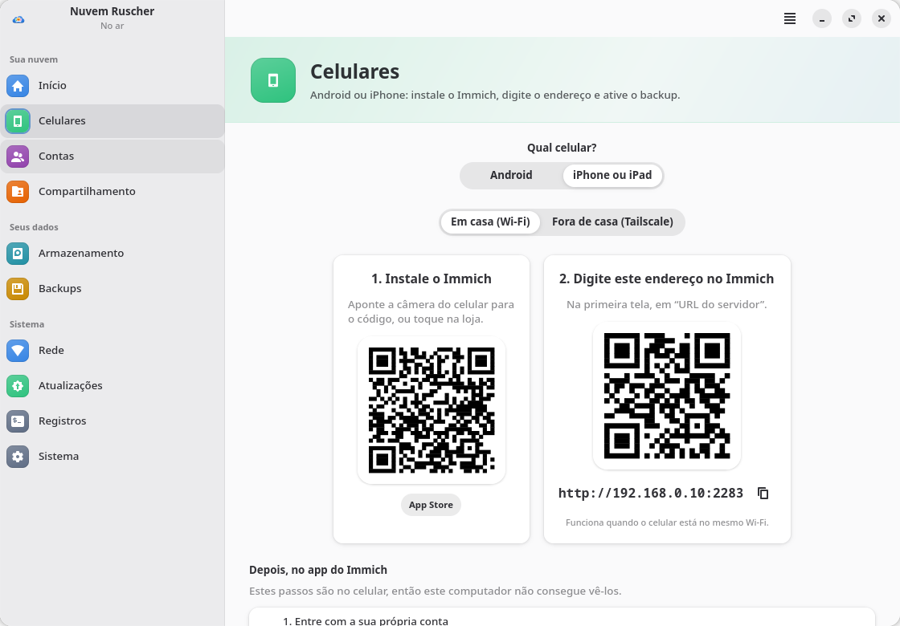 | 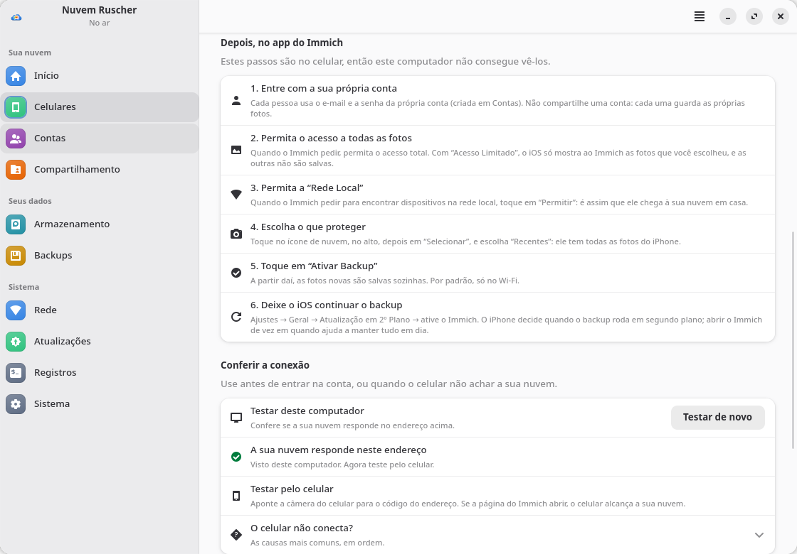 |
| **Celulares** — Android ou iPhone, loja e endereço certos | **Passos no app e teste da conexão** |
| 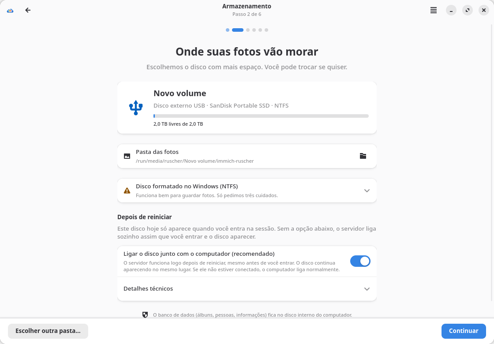 | 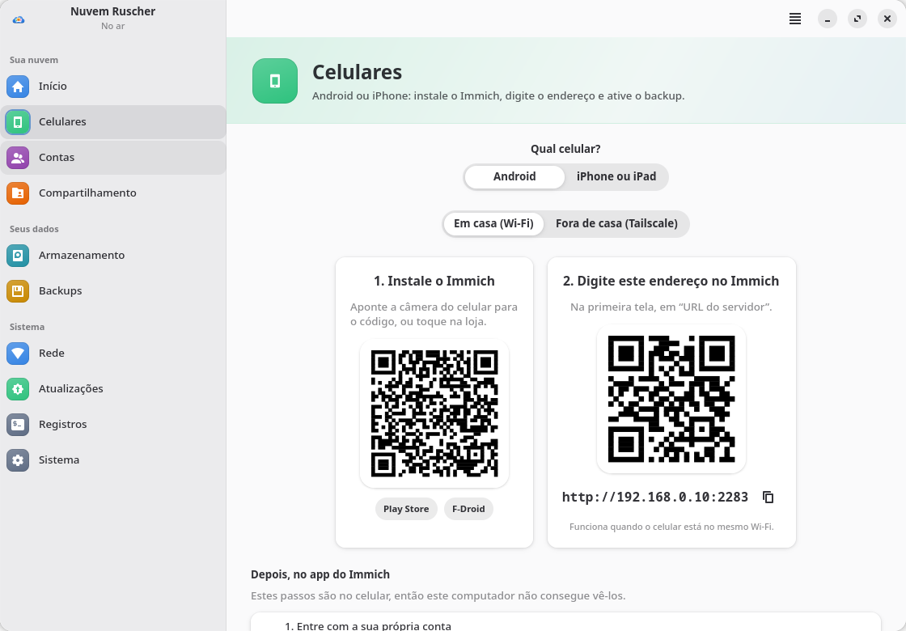 |
| **Instalação** — avisos honestos sobre o disco | **Android** — Play Store e F-Droid |

<p align="center">
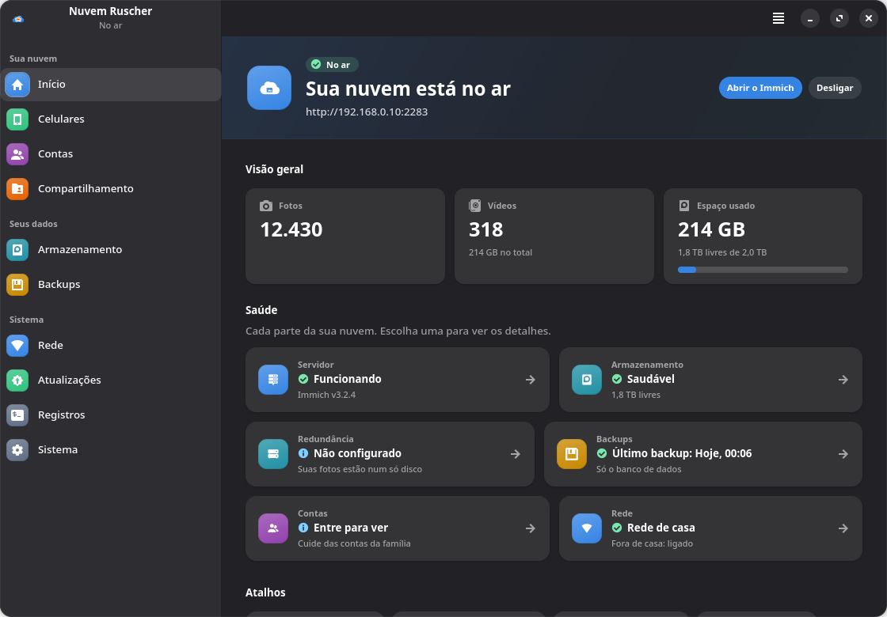
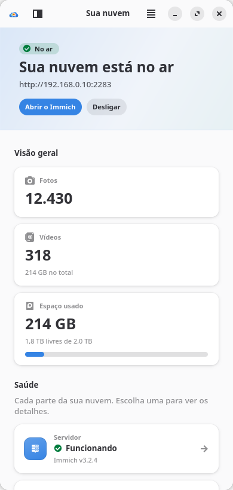
</p>

Tema claro, escuro ou o do sistema (no menu *Aparência*), e janelas estreitas (a barra lateral vira
um botão). As capturas foram feitas no modo simulado com `tools/tour.py`; as da primeira versão estão
em [`screenshots/v1`](screenshots/v1).

## Instalação

Requer BigLinux/Manjaro/Arch com KDE Plasma ou GNOME. Só pacotes dos repositórios oficiais.

```bash
git clone https://github.com/ruscher/nuvem-ruscher.git
cd nuvem-ruscher/packaging
makepkg -si
```

Depois, abra **Nuvem Ruscher** no menu de aplicativos. A senha de administrador é pedida apenas nas
etapas que mexem no sistema (instalar o Docker, registrar o serviço, editar o fstab, mudar as fotos de
lugar, criar um RAID). Para RAID e SMART, instale também `mdadm` e `smartmontools` (o app oferece).

Atualizar o pacote não reinicia o servidor de fotos, e `sudo pacman -R nuvem-ruscher` remove só o
app: servidor, fotos, banco de dados e configuração continuam onde estão (veja
[Como desinstalo?](#perguntas-frequentes)).

> **Nix:** há um `flake.nix` experimental, **ainda não testado**. Nele, o polkit do sistema não
> conhece o helper, então toda ação pede a senha de administrador. Detalhes em
> [docs/packaging-nix.md](docs/packaging-nix.md).

### Experimentar sem mudar nada

```bash
./bin/nuvem-ruscher --simulate                          # finge todas as operações de sistema
./bin/nuvem-ruscher --simulate --scenario help          # lista os cenários
./bin/nuvem-ruscher --simulate --scenario family        # quatro contas e pastas compartilhadas
./bin/nuvem-ruscher --simulate --scenario raid-degraded # RAID com um disco com falha
./bin/nuvem-ruscher --simulate --scenario migration     # um segundo disco para receber as fotos
./bin/nuvem-ruscher --simulate --scenario lan-unreachable # o teste de conexão dos celulares falha
```

Os nomes da primeira versão (`--simular`, `--cenario ajuda`, `sem-docker`…) continuam aceitos.

## Como funciona (resumo)

```
Interface (usuário comum) ──pkexec──► helper Bash (lista fechada de ações, argumentos validados)
        │                                   │
        │ docker CLI (grupo docker)         ├─ /var/lib/nuvem-ruscher/immich   compose oficial + override + .env (600)
        │ API do Immich (localhost:2283)    ├─ /etc/fstab, /etc/mdadm.conf      backup → verify → rollback
        │   contas, quotas, álbuns          ├─ migrate-storage                  rsync → verify → switch → confirm
        ▼   (sessão só na memória)          └─ nuvem-ruscher-immich.service
   painel ao vivo                                 BindsTo= disco das fotos · docker compose up · sem restart do Docker
```

- O `docker-compose.yml` **oficial da release** fica intocado; personalizações vão para
  `docker-compose.override.yml`. O container vê as fotos sempre em `/data`: trocar a pasta no
  computador não exige mexer no banco do Immich.
- Três barreiras impedem a pasta vazia “no lugar errado”: `BindsTo`/`RequiresMountsFor`,
  `ExecStartPre=mountpoint` e `create_host_path: false` — valem também para o novo local e o RAID.
- Detalhes em [`docs/`](docs): [arquitetura](docs/02-arquitetura.md),
  [armazenamento e segurança](docs/04-armazenamento-e-seguranca.md),
  [troca de local](docs/08-storage-migration.md), [RAID](docs/09-raid-management.md),
  [contas](docs/10-multi-user.md), [compartilhamento](docs/11-shared-folders.md),
  [interface](docs/12-ui-redesign.md), [idiomas](docs/13-i18n-migration.md),
  [revisão de segurança](docs/14-security-review.md), [testes](docs/15-test-plan-v2.md),
  [Android e iPhone](docs/16-ios-support.md) ([testes no iPhone](docs/17-ios-test-plan.md)),
  [empacotamento](docs/07-empacotamento.md) ([Arch](docs/packaging-arch.md), [Nix](docs/packaging-nix.md)).

## Perguntas frequentes

**Meu disco é NTFS (formatado no Windows). Tem problema?**
Funciona para as fotos. O app avisa os cuidados (remover com segurança, desligar a “Inicialização
rápida” do Windows) e nunca coloca o banco de dados nele.

**Quero levar as fotos para um disco maior.**
*Armazenamento → Trocar o local…* Escolha o destino: o app mostra quanto vai copiar e quanto espaço
há, copia com o servidor no ar e só troca depois de conferir a cópia. A cópia antiga fica até você
decidir o que fazer com ela.

**RAID substitui backup?**
Não. RAID protege contra a falha de um disco; uma foto apagada, um vírus ou um incêndio atingem todos
os discos do RAID ao mesmo tempo. Guarde de vez em quando uma cópia das fotos num disco fora de casa.

**Como cada pessoa da família usa?**
*Contas → Adicionar conta.* O app mostra o endereço do servidor, o e-mail, a senha inicial e um QR
para o celular. Cada pessoa vê só as próprias fotos e as pastas compartilhadas com ela.

**Funciona no iPhone?**
Sim, com o app oficial do Immich da App Store (iOS 15 ou mais novo). Em *Celulares*, escolha
“iPhone ou iPad”: o app mostra a App Store, o endereço e os ajustes do iOS. O iPhone decide quando
o backup roda em segundo plano; abrir o Immich de vez em quando ajuda. Quem usa Fotos do iCloud
encontra ali o que muda (e o cuidado antes de “Liberar espaço”).

**O celular não encontra o servidor.**
Em *Celulares → Conferir a conexão*, use *Testar deste computador* e depois aponte a câmera do
celular para o código do endereço: se a página do Immich abrir, o celular alcança o servidor. No
iPhone, o Immich também precisa da permissão *Rede Local*. Se houver firewall, use *Rede → Liberar
a porta 2283 para a rede de casa* (libera só redes locais e Tailscale).

**Quero acessar fora de casa.**
Instale o [Tailscale](https://tailscale.com/download/linux) aqui e no celular; o app mostra o
endereço e o QR certos.

**Como desinstalo?**
*Sistema → Desinstalar o servidor* remove containers e serviço; fotos e banco ficam. Depois,
`sudo pacman -R nuvem-ruscher` remove o app.

## Desenvolvimento

```bash
make test       # pytest: núcleo, helper em sandbox, simulado, interface, instalação, i18n
make lint       # ruff, shellcheck, desktop-file-validate, appstreamcli
make pot        # extrai os textos (em inglês) para po/nuvem-ruscher.pot
make update-po  # leva os textos novos para po/*.po (hoje: pt_BR)
python3 tools/tour.py build/capturas [--dark] [--narrow] [--scenario NOME] [--extra migration,raid,accounts,phones]
```

Python 3 + GTK4 + libadwaita (PyGObject), helper em Bash, Docker via CLI. Sem pip, sem etapa de build.
O texto-fonte da interface é inglês; as traduções ficam em `po/`.

## Licença

GPL-3.0-or-later. O Immich é um projeto independente, licenciado sob AGPL-3.0.
