<div align="center">


# Nuvem Ruscher

**Seu próprio Google Fotos, neste computador.**
Instala, configura e cuida do [Immich](https://immich.app) no BigLinux, com as fotos no disco
que você escolher e o celular Android pronto para enviar tudo sozinho.


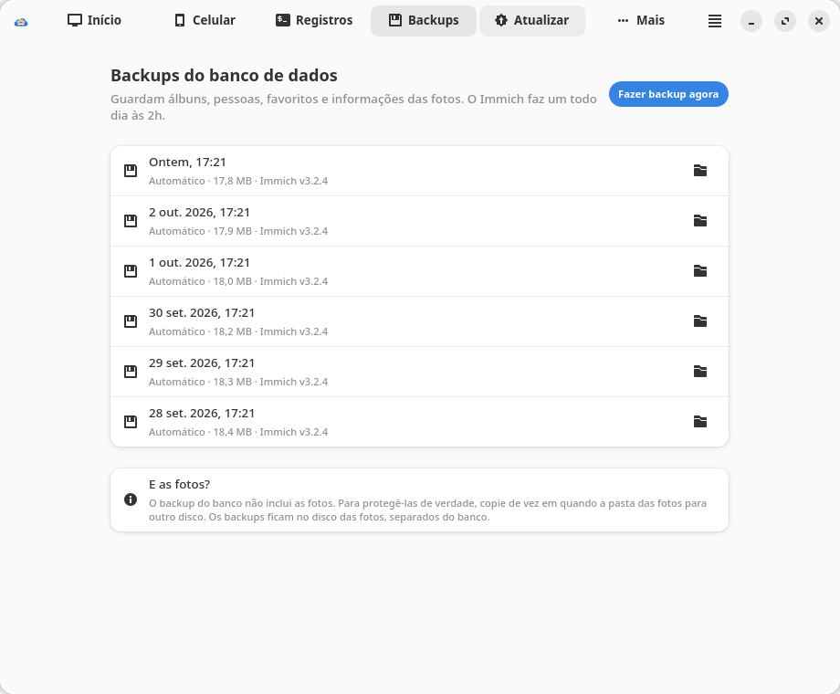

</div>

---

## O que ele faz

- **Assistente em 8 telas**, do primeiro clique ao celular sincronizando: verificação do sistema com
  correção em um clique, escolha do disco, ajustes, instalação com progresso real, criação da conta,
  QR codes para o celular e uma celebração no fim.
- **Fotos sagradas.** Nada nos seus discos é apagado, formatado ou movido. O banco de dados fica no
  disco interno; as fotos, no disco que você escolheu.
- **Funciona depois de reiniciar.** O servidor só liga com o disco das fotos montado — e liga sozinho
  quando ele aparece. Montagem no boot pelo `/etc/fstab` é opcional, com consentimento, cópia de
  segurança, validação e volta automática se algo falhar.
- **Painel ao vivo:** status de cada componente, CPU e memória, espaço no disco, quantidade de fotos
  e vídeos, registros com filtro, backups do banco, Tailscale para acesso fora de casa.
- **Atualização segura:** mostra as novidades e avisa sobre mudanças incompatíveis; faz backup e uma
  cópia instantânea do banco antes, confere a saúde depois e **volta sozinho** se a nova versão não
  responder.
- **Desinstalação honesta:** remove o servidor, nunca as fotos (e guarda o banco para uma futura
  reinstalação reaproveitar tudo).

## Capturas

| | |
|---|---|
| 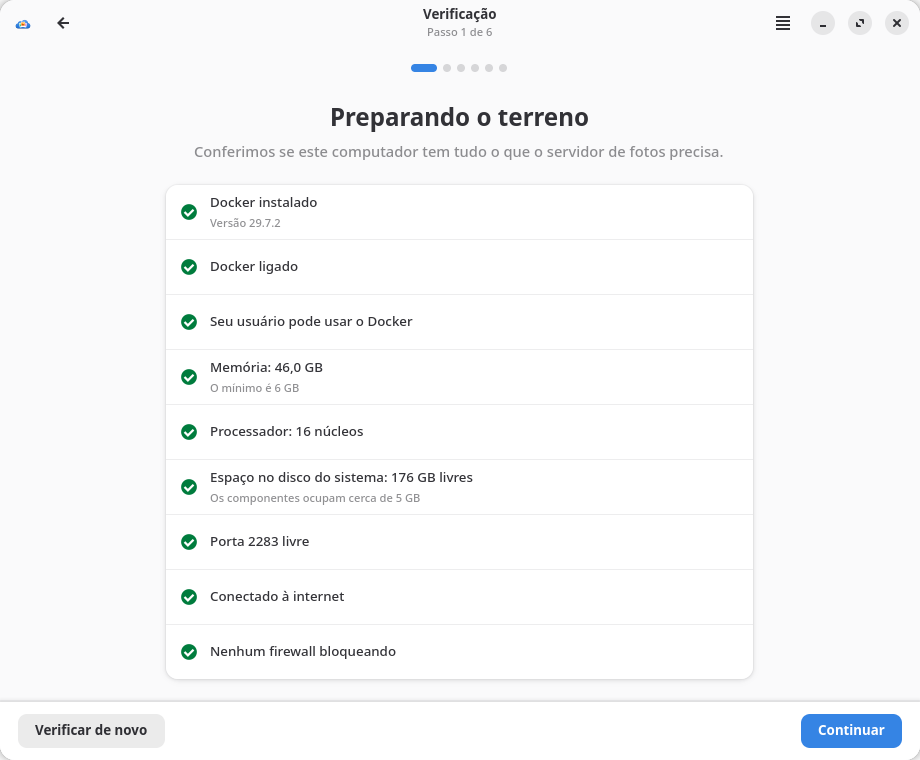 | 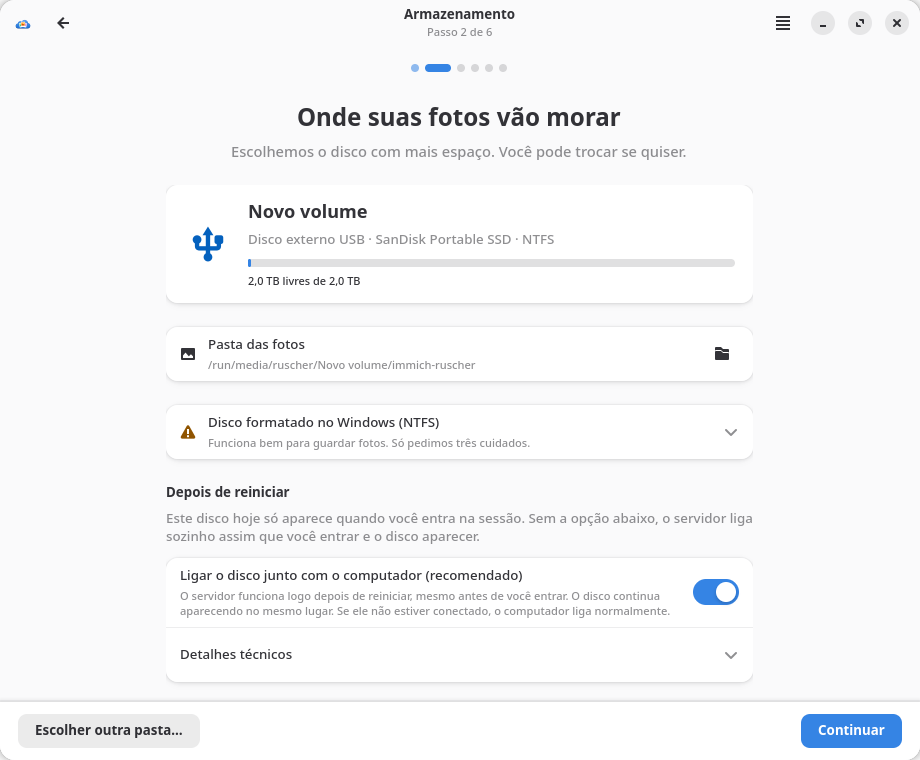 |
| **Verificação** — cada problema tem um botão que resolve | **Armazenamento** — avisos honestos sobre NTFS e montagem no boot |
| 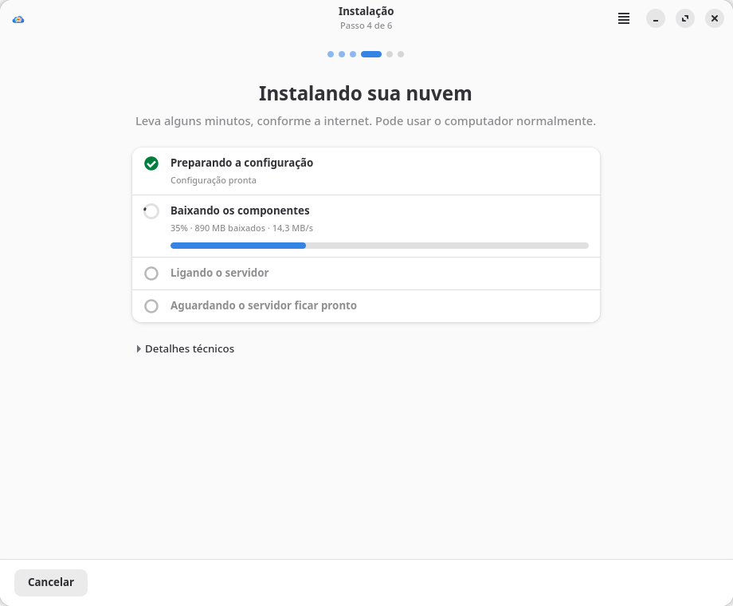 | 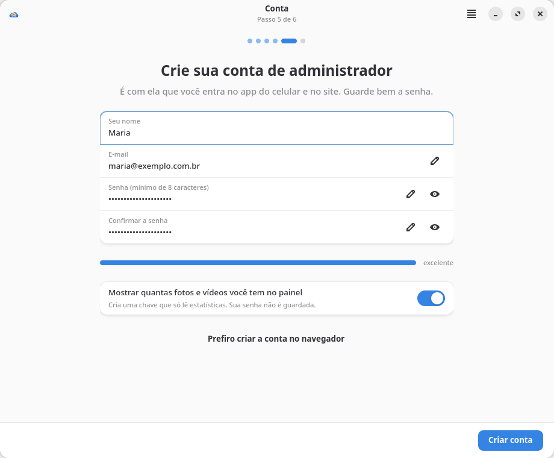 |
| **Instalação** — progresso real, cancelável e retomável | **Conta** — o administrador é criado direto no app |
| 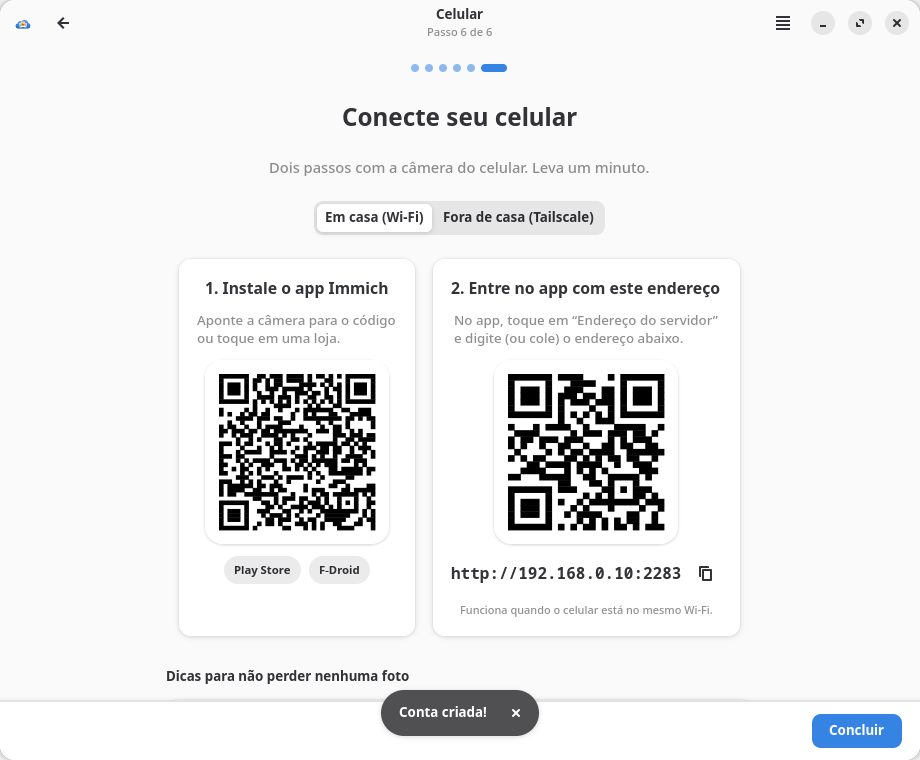 |  |
| **Celular** — QR para o app e para o endereço | **Pronto!** |
| 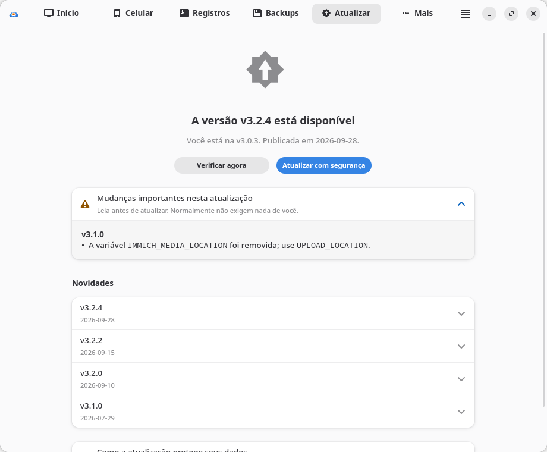 | 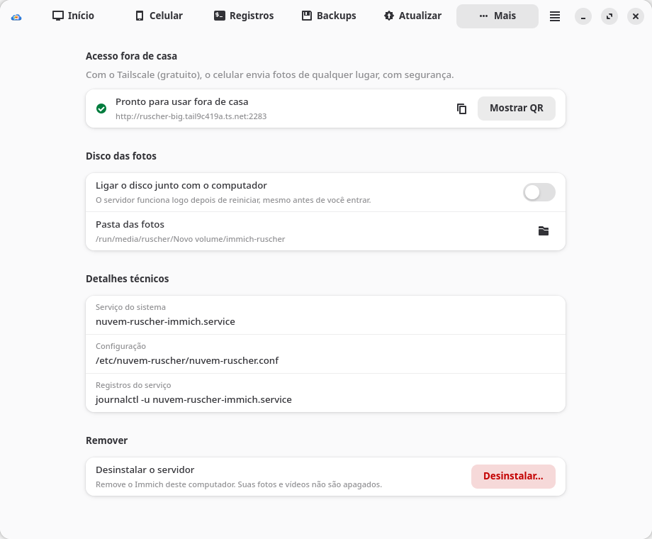 |
| **Atualizar** — alerta de mudanças importantes | **Mais** — Tailscale, disco, desinstalar |

<p align="center">
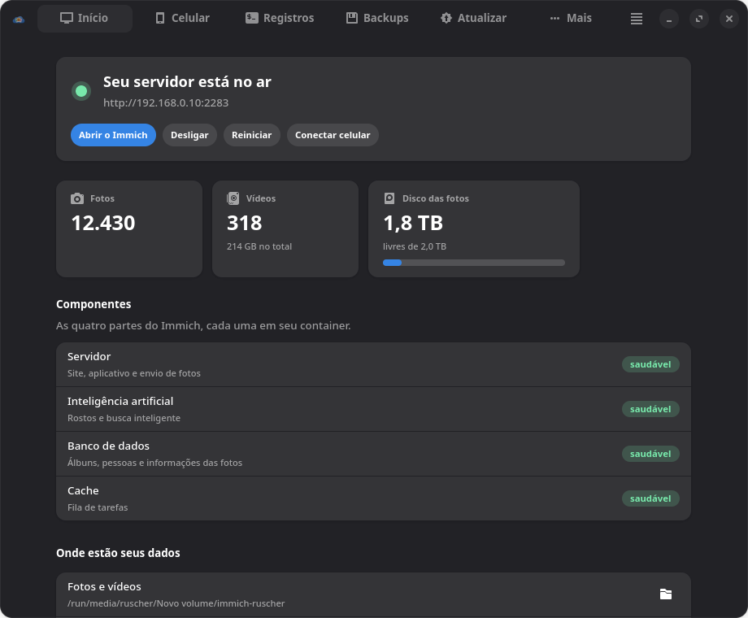

</p>

Tema claro e escuro, cor de destaque do sistema e janelas estreitas (as abas vão para baixo).
As capturas acima foram feitas no modo `--simular` com `tools/tour.py`. Abaixo, o painel real
nesta máquina, logo após a instalação (antes de criar a conta, por isso sem contagem de fotos):

<p align="center">
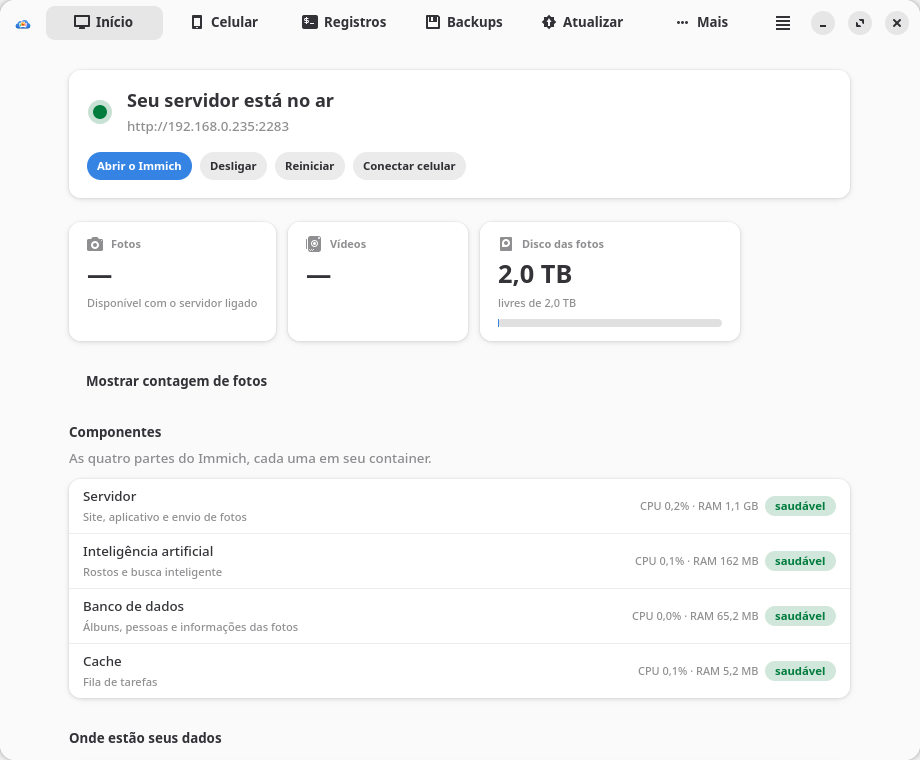
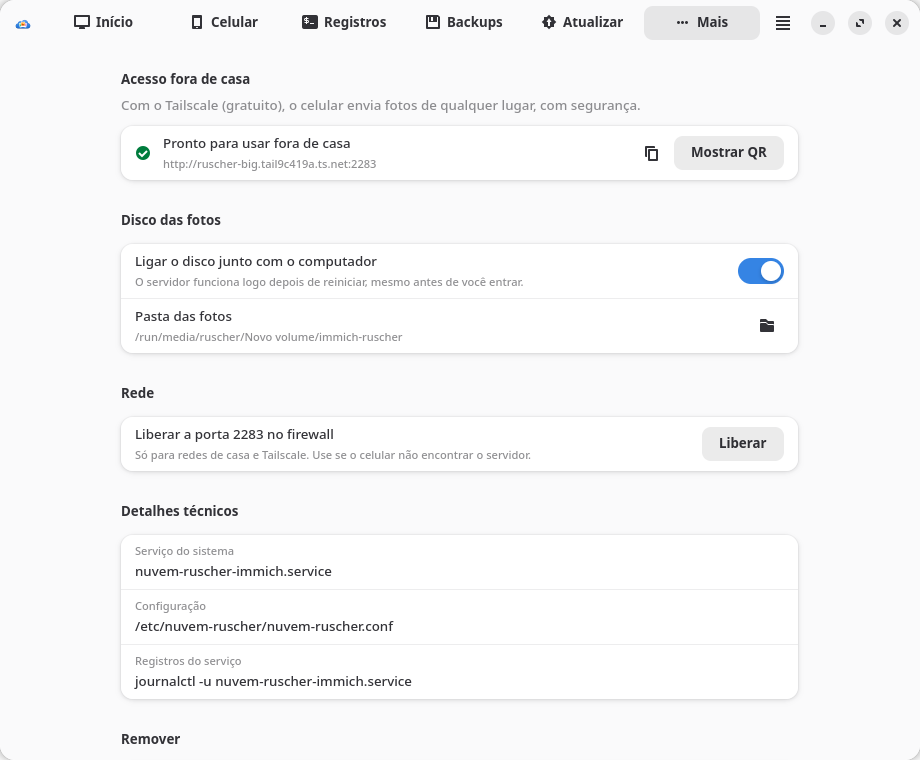
</p>

## Instalação

Requer BigLinux/Manjaro/Arch com KDE Plasma ou GNOME. Só pacotes dos repositórios oficiais.

```bash
git clone https://github.com/ruscher/nuvem-ruscher.git
cd nuvem-ruscher/packaging
makepkg -si
```

Depois, abra **Nuvem Ruscher** no menu de aplicativos. A senha de administrador é pedida apenas nas
etapas que mexem no sistema (instalar o Docker, registrar o serviço, editar o fstab).

### Experimentar sem mudar nada

```bash
./bin/nuvem-ruscher --simular                   # finge todas as operações de sistema
./bin/nuvem-ruscher --simular --cenario ajuda   # lista os 20 cenários
./bin/nuvem-ruscher --simular --cenario sem-docker
./bin/nuvem-ruscher --simular --cenario atualizacao-falha
```

## Como funciona (resumo)

```
Interface (usuário comum) ──pkexec──► helper Bash (lista fechada de ações, argumentos validados)
        │                                   │
        │ docker CLI (grupo docker)         ├─ /var/lib/nuvem-ruscher/immich   compose oficial + override + .env (600)
        │ API do Immich (localhost:2283)    ├─ /etc/fstab                       backup → verify → rollback
        ▼                                   └─ nuvem-ruscher-immich.service
   painel ao vivo                                 BindsTo= disco das fotos · docker compose up · sem restart do Docker
```

- O `docker-compose.yml` **oficial da release** fica intocado; personalizações vão para
  `docker-compose.override.yml` (`restart: "no"`, bind de `/data` com `create_host_path: false`,
  GPU).
- Três barreiras impedem a pasta vazia “no lugar errado”: `BindsTo`/`RequiresMountsFor`,
  `ExecStartPre=mountpoint` e `create_host_path: false`.
- Detalhes em [`docs/`](docs): [pesquisa do Immich](docs/01-pesquisa-immich.md),
  [arquitetura e decisões](docs/02-arquitetura.md), [design](docs/03-design-ux.md),
  [armazenamento e segurança](docs/04-armazenamento-e-seguranca.md),
  [testes](docs/06-testes-e-qa.md), [empacotamento](docs/07-empacotamento.md).

## Perguntas frequentes

**Meu disco é NTFS (formatado no Windows). Tem problema?**
Funciona para as fotos. O app avisa os cuidados (remover com segurança, desligar a “Inicialização
rápida” do Windows) e nunca coloca o banco de dados nele.

**O celular não encontra o servidor.**
Confirme que está no mesmo Wi-Fi e use o endereço mostrado em *Celular*. Se houver firewall, use
*Mais → Liberar a porta 2283* (libera só redes locais e Tailscale).

**Quero acessar fora de casa.**
Instale o [Tailscale](https://tailscale.com/download/linux) aqui e no celular; o app mostra o
endereço e o QR certos.

**Como desinstalo?**
*Painel → Mais → Desinstalar o servidor* remove containers e serviço; fotos e banco ficam. Depois,
`sudo pacman -R nuvem-ruscher` remove o app.

## Desenvolvimento

```bash
make test     # pytest: núcleo, helper em sandbox, modo simulado
make lint     # ruff, shellcheck, desktop-file-validate, appstreamcli
make pot      # extrai os textos para po/nuvem-ruscher.pot
python3 tools/tour.py /tmp/capturas [--escuro] [--estreito] [--cenario NOME]
```

Python 3 + GTK4 + libadwaita (PyGObject), helper em Bash, Docker via CLI. Sem pip, sem etapa de build.

## Licença

GPL-3.0-or-later. O Immich é um projeto independente, licenciado sob AGPL-3.0.
